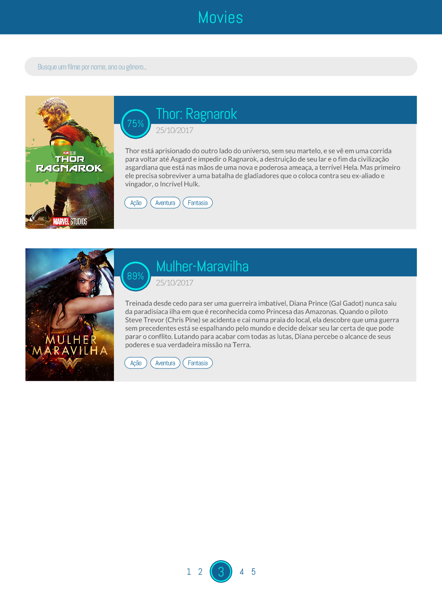
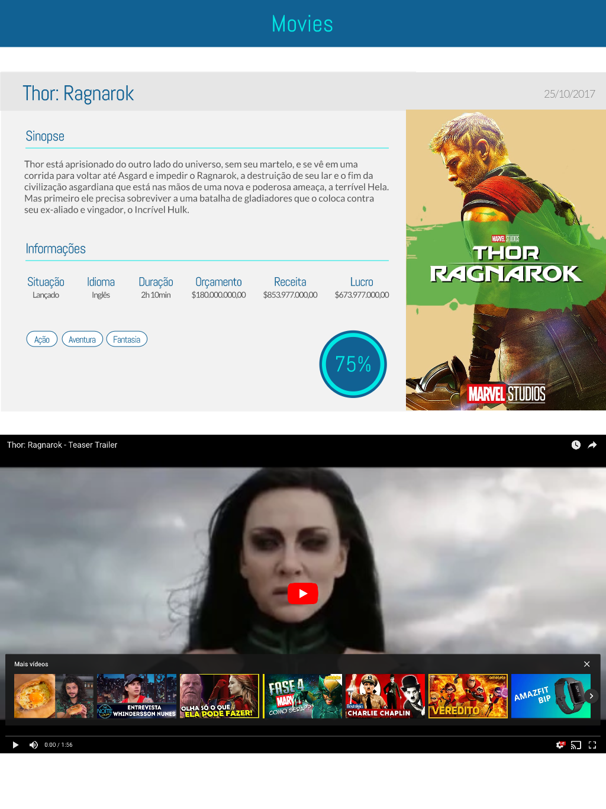

# Desafio técnico web - [Eshows](https://www.eshows.com.br)

## Objetivo

Implementar um web app responsivo que consuma a [API do The Movie DB](https://www.themoviedb.org/documentation/api) e permita buscar e ver detalhes de filmes de seu catálogo.

## Especificações
### Especificações obrigatórias

O web app _deve_:

- Ter as seguintes funcionalidades:
    - Permitir buscar filmes por nome ou gênero
    - Resultados de busca paginados, 5 por página
    - Exibir nos resultados da busca: nome, cartaz, data de lançamento, sinopse e pontuação do filme
    - Possa ver, ao clicar em um resultado da busca, detalhes do filme além dos mostrados na busca, como: status (lançado, previsto, etc), idioma, duração, orçamento, receita, lucro, categorias e trailer, quando disponíveis.
- Ser responsivo
- Ter boa performance
- Funcionar na última versão dos principais browsers (Chrome, Firefox, Safari e Edge)
- Fizer uso de uma ou mais das seguintes ferramentas:
    - React, Vue, Angular ou similares
    - Typescript, Flow ou similares
    - Redux, Vuex, MobX ou similares

Abaixo estão algumas imagens que podem dar um direcionamento, mas você não precisa seguir essas definições de layout.

> Resultados de busca:
> 

---

> Detalhes de filme:
> 

O web app _não pode_:

- Fazer uso de frameworks CSS, como Bulma, Bootstrap, Foundation e etc...

### Especificações adicionais

As especificações a seguir _não são obrigatórias_, mas contam pontos _extras_:

- Ter HTML semântico
- Fazer uso de técnicas avançadas em CSS, HTML e Javascript
- Demonstrar domínio de features modernas (ES6+) do Javascript
- Ser um PWA

## Entrega

O projeto do desafio técnico deve ser entregue em um dos seguintes formatos:
- Repositório hospedado (Github, Gitlab, Bitbucket ou similares)
- Arquivo compactado

Em ambos os casos, deve constar no projeto um arquivo chamado README.md com instruções para a compilação/execução do web app.

Obs.: Não faça fork ou envie pull request com os códigos.

Este desafio foi copiado descaradamente (mas com autorização) desse repositório aqui: https://gitlab.com/gbrennon/desafio-dev-front/